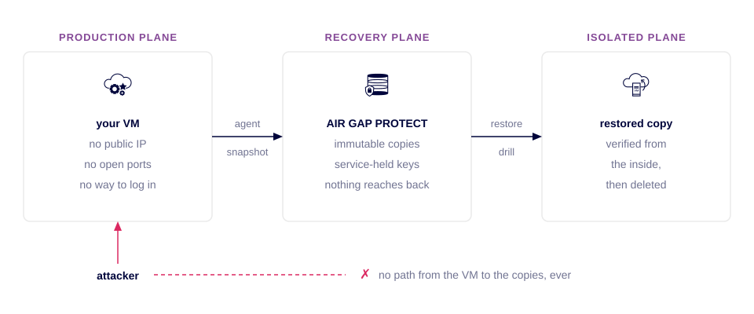
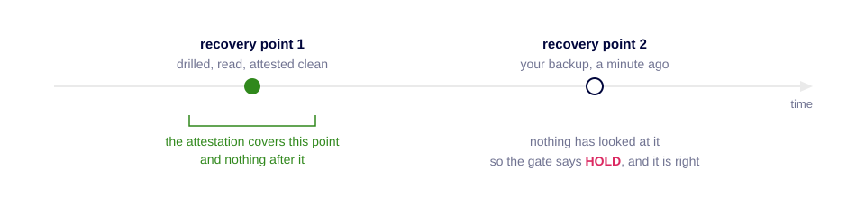
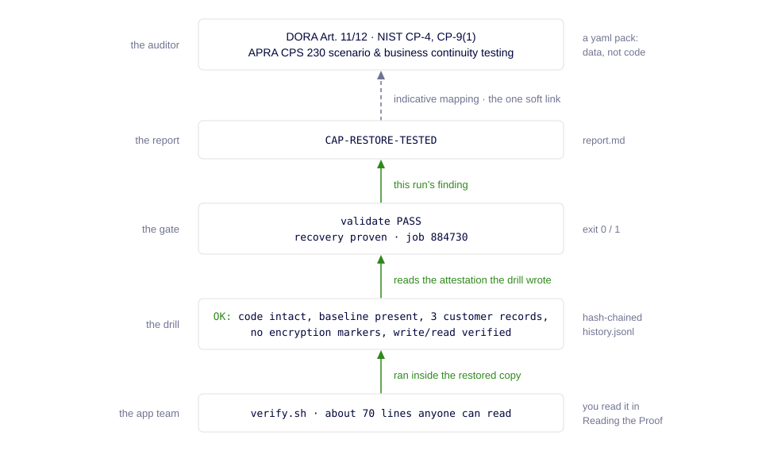
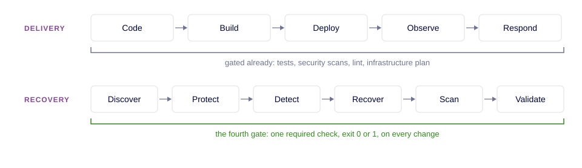

# DevOps Meets ResOps

> **A hands-on workshop in Resilience Operations:** proving recovery the way
> you already prove everything else. Continuously, on evidence, and gated
> before it ships.

```hero
$ op gate infra/workloads
  ●●●●●●  VALIDATED
  PROMOTE  exit 0

$ op threatscan infra/workloads
  THREATS DETECTED

$ op gate infra/workloads
  ●●●●✗·  RECOVERABLE
  HOLD  exit 1
```

---

## Half Your Pipeline Was Engineered

Your delivery pipeline is versioned, automated, owned and observable at
every stage: code, build, deploy, observe, respond. You would not accept a
manual step in any of them, and you would not ship a service whose deploy
path had never run.

Recovery has four equivalent stages, and in most cloud teams none of them
works that way.

```
  ENGINEERED   Code ── Build ── Deploy ── Observe ── Respond
  A HANDOFF    Recover ┄┄ Validate ┄┄ Prove ┄┄ Improve
```

For most cloud teams that second row belongs to another team, lives in a
runbook, and is exercised once a year by someone who does not deploy your
code. That is not a criticism of anyone. It is the half nobody got to yet.

```list
 DevOps      optimizes for   Speed and reliability of delivery.
 SecOps                      Detection and containment of threats.
 IT Ops                      Stability and availability of systems.
 CloudOps                    Cost and performance of infrastructure.
```

All four assume the business is running normally. ResOps is the only one
built for the moments when it is not.

## What is ResOps?

Resilience Operations is the operational discipline that unites security,
infrastructure, and operations teams around critical services, resilient
system design, and continuous validation, so an organization can withstand
disruption, recover within defined impact tolerances, and prove it with
evidence.

It is an operating model, not a product.

```
 Backup asks    do we have copies?
 DR asks        can we recover if the data center is down?
 BCP asks       have we written down what we would do?
 ResOps asks    can we PROVE critical services recover, clean,
                within tolerance, on demand?
```

The first three questions can be answered from a document. The fourth can
only be answered by opening a recovery point and reading what is inside it,
which is what you spend the next two hours doing to a real service.

## Who this is for

```list
 LEVEL            300-400.
 DURATION         Two hours facilitated, about three hours self-paced.
 WRITTEN FOR      Platform engineers, SREs and cloud architects who already
                  run CI, infrastructure as code and required checks, and
                  the people who fund that work.
 ASSUMES          You are comfortable with a terminal, a pull request and a
                  cloud console. No backup or recovery background is needed.
 NOT FOR          Teams looking for a backup product evaluation, or a
                  step-by-step guide to configuring one. Neither is what
                  this covers.
 YOU WILL LEAVE   Able to explain, and to demonstrate, why recoverability
                  belongs in the same place as your other required checks.
```

## The one idea

```statement
You gate on tests.
You gate on security scans.
**You do not gate on recoverability.**
```

You have taken a whole class of failure and moved it from *we find out in
production* to *we find out at the pull request*, three times over.


## What you will walk

```list
 Building the Workload        Recovery, demonstrated. Most estates have
                              never done it once.
 Reading the Proof            What good looks like, on a day when yes is
                              boring.
 Introducing a Compromise     Green is a job status, not a verdict about
                              your data.
 Choosing a Recovery Point    Under compromise, the freshest recovery
                              point is the most dangerous one.
 Re-Proving Recovery          Trust is re-opened, not re-assured.
 Gating the Pipeline          The fourth shift-left, shaped exactly like
                              the other three.
 Cleaning Up                  Disposable by design, because a drill has
                              to be cheap to repeat.
```

Some of these chapters run against a real Azure VM and a real backup
platform. The rest run entirely offline, with no cloud and no token, and
cannot fail. Setup lists what the live half needs.

This page works with the network off. In a facilitated session the lab is
provisioned, drilled and retired for you, and you arrive with your workload
already at `VALIDATED`.

**The expected results for the offline commands were checked by running
them. The ones for the live commands are written from the code and have not
yet been watched against a real tenant.** If your screen does not match a
box, the box tells you what to do about it. If it still does not match, tell
your facilitator: the box may be the thing that is wrong.

## Setup

Ten minutes of readiness, so the rest of the workshop is all signal. In a
facilitated session most of this is done for you.

**What you need.** Almost nothing: the environment is built for you.

```list
 a Codespace                Open this repository in a Codespace and wait for
                            it to finish building. `resops`, `op`, `az` and
                            `terraform` are already on your PATH, and
                            Grafana, Prometheus and a pushgateway are already
                            running beside you.
 five credentials           Three for Azure and two for Commvault Cloud, from
                            your facilitator. They go in `.env`, which you
                            create by renaming `.env.example`.

                            The Azure credential is a service principal
                            scoped to ONE resource group, issued to you. It
                            cannot reach anything else in the subscription,
                            which is why several checks in this workshop
                            report **skipped** rather than failing.
 three fields               In `config/workshop.yaml`: your codename, your
                            resource group, and the attestation path. Every
                            other id in that file is already filled in and is
                            the same for everyone.
 nothing else               No clone, no virtual environment, no `az login`
                            beyond the one step in this workshop, and no
                            local install of anything.
```

**This lab provisions real Azure resources and they bill until you retire
them in Cleaning Up, the closing chapter of the self-paced path.** Budget
eight minutes for it, and do not skip it. In a facilitated session the
facilitator retires the lab.

### How to read the commands on this page

```list
 $ at the start     A command for you to run. The `$` is the prompt and is
                    not part of the command; the copy button gives you the
                    command without it.
 op                 The write lane, and `resops` the read-only one.
                    Both are real commands on your PATH; type them exactly
                    as printed. `infra/workloads` is the final argument to
                    every `op` command and never changes.
 no $               Output from the machine. You do not type these lines.
 angle brackets     A placeholder, carrying your own workload name. It
                    appears in expected output, never inside a command, so
                    every command on this page is the same for everyone.
 ✓                  What the command should print. Compare, do not guess.
 ✗                  What to do when it does not. Every one names an action.
 ⏱                  How long it takes, and what is happening while you wait.
```

### Prove your machine is ready

```bash
which op resops
```

```
 ✓ YOU SHOULD SEE   two paths, both inside the Codespace. That is the whole check.
                    /workspaces/resopsv2-demo/.venv/bin/op
                    /workspaces/resopsv2-demo/.venv/bin/resops
 ✗ IF NOT           setup had not finished when this terminal opened. Run bash .devcontainer/postCreate.sh, then open a new terminal. In a room, ask now rather than when the first command runs.
```

### Sign in, and check what you filled in

Terraform reads `ARM_*` from `.env` by itself. The `az` CLI does not, and
several checks in this workshop go through it. One block does both: sign in,
then read your own config back.

```bash
az login --service-principal \
  -u "$ARM_CLIENT_ID" -p "$ARM_CLIENT_SECRET" \
  --tenant "$ARM_TENANT_ID" -o none
op validate infra/workloads
```

```
 ✓ YOU SHOULD SEE   a PASS list, ending in the line that says you are safe to start. IAM reports skipped: that check needs subscription-level read, which your credential does not have, and skipped is the honest word for it.
                    PASS  config/workshop.yaml — no placeholder values
                    PASS  az logged in, correct subscription
                    validate PASS — safe to climb and teardown
 ⏱ HOW LONG         about twenty seconds
 ✗ IF NOT           the FAIL line names the field. `has N unfilled field(s)` lists every one it found by name: you have not finished `config/workshop.yaml`. `az not logged in` means the login above did not take, usually a secret pasted without its quotes.
```

This is the only command that reads what you typed. Everything after it
assumes you got it right, and the field most worth getting right is
`attestation_file`: it must contain your codename. The restore drill writes
there and the Scan rung reads there, so a mismatch turns the last step of the
workshop from a yes into a no, ninety minutes from now.

### Open the wall

Your terminal shows one workload at a time. The other screen shows all of
them at once, and it is the one your organization would actually look at.
Open it now, while nothing has moved, so you have seen the starting state.

```list
 where              the Ports tab in your Codespace, port 3000. It is
                    labeled Grafana — ResOps dashboard.
 sign in            `admin` / `resops`
 the dashboard      ResOps → DevOps Meets ResOps
```

```
 ✓ ON THE WALL      six services you did not build, and three numbers asking three different questions: how many cannot prove recovery, how fast a clean one takes, and how often checking found something. It was populated when your Codespace was built, from committed fixtures, so it is not empty and it is not yours.
                    Cannot prove recovery          5 of 6
                    Mean Time to Clean Recovery    3 hr
                    Checks that found a problem    1 of 3
 ✗ IF NOT           an empty dashboard means the seed did not run. `bash .devcontainer/postCreate.sh` publishes it again. A login loop means the browser cached an old session: open the port in a private window.
```

The middle one carries no color on purpose. It is a measurement, not a
verdict, and nobody has agreed a target to judge it against. You meet that
number properly in Chapter 5, measured on your own workload.

Underneath the numbers is a band per service, and every band is flat. Nothing
in this estate has ever moved, because nothing in this estate has ever been
run. Yours will not be flat.

Leave this tab open. From here on, every command that moves your workload
republishes to this page on its way out, and the guide will tell you when to
look. The two read-only checks, `op validate` and `op preflight`, leave it
alone: they change nothing, so they claim nothing.

### When something fails

Search this page for the text your terminal printed. The left column is the
error, verbatim.

```list
 missing workshop.yaml         The file was deleted or renamed. It is
                               tracked, so `git checkout config/workshop.yaml`
                               restores it. Fill your three fields again.
 no `workload` output          `terraform apply` has not run, or ran in a
                               different directory. Run it from the repository
                               root.
 not in /VM                    Discovery has not run. It is the one manual
                               step in this workshop: Command Center,
                               Protect, Virtualization, your hypervisor,
                               Discover.
 no vmgroup for                `op protect` has not run for this workload yet.
 could not run the command     The VM is not running, or its guest agent is
                               not ready. The agent needs about two minutes
                               after boot. Retry once before investigating.
 Waiting                       The job is queued for a media agent, the shared
                               worker that moves the data. About two minutes
                               is normal and up to 27 has been seen.
                               Do not kill it.
 threatscan trigger refused    The scan plan id is missing or wrong. Set
                               `scan_plan_id` in `config/workshop.yaml`.
 climb stops at the drill      The drill did not pass, which is the drill
                               doing its job. Read the `FAIL:` line: it names
                               what it found inside the restored copy.
 no run to publish             `op gate` has not run yet. `metrics` publishes
                               the last run rather than taking its own.
 attestation stale             Something backed up after your last drill, so
                               the proof no longer covers the newest recovery
                               point. Run the drill again.
```

**Before investigating anything, run these three.** All are read-only.
`op validate` and `op preflight` run even when your Commvault token is dead,
and tell you so; `op status` needs a working one.

```
 op validate     Does your config parse, and are the ids present?
 op preflight    Can this machine reach Azure and the tenant?
 op status       What does the platform currently believe about your workload?
```

### Three questions, before anything runs

Write these down now and set them aside; how they read to you afterward is
the measure of the workshop.

Very few organizations can answer the first question with confidence. That
is the industry's position today, not a judgement on any one team, and it is
the reason this workshop exists. An honest low number is worth more here
than a confident one.

```list
 1   What percentage of your production estate could you PROVE is
     recoverable, right now?

     Not "is backed up". Proved, by something that opened a copy and read
     what was inside it. A backup dashboard reports that a job ran. That
     is a different claim, and most estates have only that one.
 2   Who would you have to convince, and what would they accept as proof?

     Name a real person. An auditor accepts a document. A staff engineer
     accepts a command they can run themselves. Those are different
     artifacts, and most teams have only the first.
 3   How long would producing that proof take, starting now?

     Count the people who would have to be asked. Where that answer is
     measured in weeks, the constraint is usually organizational rather
     than technical.
```

---

## Chapter 1 · Building the Workload · SOLO

```
 STAGE      All six. Discover, Protect, Detect, Recover, Scan, Validate: the
            full climb, once, so you have seen what a yes is made of.
 EXERCISE   Stand up a production service, protect it, and climb it to a
            proven recovery
 LEARN      The three planes, the one door into a sealed VM, and what a
            drill actually opens
 RULE       Recovery is demonstrated or it is assumed. There is no third
            state.
 NEXT       Pick one workload you own and find out whether the platform has
            even discovered it. Read-only. Today.
 DONE WHEN  `op gate infra/workloads` says PROMOTE and exits 0. That is
            recovery demonstrated rather than assumed. If it holds and
            names Scan, the drill has not run: `op restore` first.
```

This chapter builds three environments and moves a workload through all of
them. They are worth seeing before you start, because every verdict in this
workshop depends on which one produced it.

### The three planes you are about to build



The production plane is an Azure VM running a live service, locked down
the way production should be: no public IP, no inbound rules, no
interactive access. All operations flow through managed control planes,
the Azure guest agent and the Commvault Cloud API, which is exactly how
the workshop's commands, and a real incident response, reach it.

Commvault Cloud copies that service into the recovery plane: immutable
storage held in the platform's own security domain. The isolation here is not
a disconnected network. It is that the credentials for that storage belong to
the service and never to the workload, so nothing running on the VM can reach
the copies, including anything an attacker puts there. Restore drills rebuild
a copy of the service in the third plane, verify it from the inside, and
remove it.

Three planes, and trust flows one way. Every verdict in this workshop is
read from the copy rather than from the machine that produced it, because a
compromised machine can only report on itself.

If you have not used Commvault before, this is what you are about to touch:

```list
@cloud-server PRODUCTION PLANE   An Azure VM, built by Terraform, running a
                    small service.
@secure-storage RECOVERY PLANE   Commvault Cloud, protecting that VM into an
                    immutable copy held in its own security domain, with
                    credentials the VM never has.
@ransomware DETECTION            A scan that opens a recovery point in the
                    recovery plane and reads it there, without touching
                    production.
@vm-restore ISOLATED PLANE       An out-of-place restore: a new VM built from
                    one recovery point, verified from the inside, then deleted.
@command-center THE CONSOLE      Command Center, the web console the platform
                    is operated from. Every OPERATION here is an API call,
                    which is what makes it repeatable. You open the console
                    once to do the one thing that cannot be scripted, and
                    twice more to read what your security colleague reads.
```

When a concept deserves the fuller story, look for the HOW IT WORKS notes
as you go.

One `terraform apply` gives you the first of the three: a VM with no public
IP, no inbound rules and no interactive access. Every command from here
reaches it through the Azure guest agent or the Commvault Cloud API, and each
one prints what it did so you can compare it against the box below.

### Provision the service

```bash
terraform -chdir=infra/workloads apply -auto-approve
```

```
 ✓ YOU SHOULD SEE   the apply finish, then one output object. This is the contract: every later command reads these eight facts instead of reconstructing names, so nothing downstream has to guess what you called things.
                    Apply complete!
                    Outputs:
                    workload = {
                      "location" = "eastus2"
                      "resource_group" = "rg-lab-<your-handle>"
                      "restore_storage_account" = "st<...>"
                      "subnet_id" = "/subscriptions/<...>"
                      "vm_guid" = "<...>"
                      "vm_name" = "<your-codename>"
                      "vm_size" = "Standard_F1als_v7"
                      "vnet_name" = "vnet-<your-codename>"
                    }
 ⏱ HOW LONG         two to four minutes
 ✗ IF NOT           read the first error line and nothing else. Quota and an expired login are the usual causes: run az account show, then retry once. If it asks you to run terraform init, run `terraform -chdir=infra/workloads init -input=false` once, then apply again.
```

```
 ? HOW IT WORKS: THE ONLY DOOR
   The VM has no network path in, so commands travel through the Azure
   guest agent: a process inside the VM that Azure hands scripts to,
   with your subscription's credentials as the key. Every plant, every
   repair, and every drill verification in this workshop goes through
   that one door, and the door works even when the network is
   compromised.
```

### Connect the platform

Bringing new cloud resources under protection is an operation the platform
keeps behind its own controls, so this step happens in **Command Center**, the
Commvault Cloud web console. It is the only operation in this workshop that is
not an API call, and the only one that may need somebody else: the workshop's
API token is refused here by design, and depending on how your account is set
up the console may refuse you too. If it does, your facilitator runs it once
for the room.

```list
 1   Sign in to Command Center and open **Protect**, then **Virtualization**,
     then your Azure connection. Its name is in your session instructions,
     or in your own config as `platform.hypervisor.name`.
 2   Click **Start discovery**.
 3   Wait for **Last update**, at the top of the page, to change to the
     current time with a green check beside it.
 4   Open the **Resources** tab and filter by your connection.
```

```
 ✓ YOU SHOULD SEE   three resources, and your VM among them
                    <your-codename>   Azure VM   30 GB   Not protected
 ⏱ HOW LONG         about two minutes. The page does not refresh itself, so
                    `Last update` is what tells you the job finished.
 ✗ IF NOT           if your VM is missing, discovery ran before your
                    `terraform apply` finished. Click **Start discovery** again.
                    If the button is greyed out, or the page returns an error,
                    your account is read-only on this connection: ask your
                    facilitator to run discovery, then re-check the Resources
                    tab. Nothing else in the workshop needs this permission.
```

```
 ? HOW IT WORKS: THREE RESOURCES, AND WHY NONE IS PROTECTED
   Your `terraform apply` created a VM, a storage account used for restore
   staging, and the table storage inside it. Discovery lists all three
   because all three are Azure resources in the subscription. Only the VM is
   your workload.

   All three read Not protected, which is correct here. Discovery makes a
   resource visible to the platform. Protection is a separate decision, and
   it is what `op protect` does later in this chapter.

   That Resources tab is the same view `op preflight` reads. The next command
   asks the API the question you just answered by eye.
```

```bash
op preflight infra/workloads
```

```
 ✓ YOU SHOULD SEE   five PASS lines, then the line that says you are safe to climb. The one that matters names your workload as discovered by the platform.
                      PASS  <your-codename> discovered (cloud-native inventory)
                    preflight PASS — safe to climb
 ✗ IF NOT           a FAIL line names its own fix. "not discovered" should not happen now that you have seen your VM in the Resources tab; if it does, the console and the API disagree and the facilitator wants to know.
```

### The first recovery point

```bash
op protect infra/workloads
```

```
 ✓ YOU SHOULD SEE   a VM group created, with your VM's id attached to it. The number is the group's id, and it is what every later command addresses. A VM group is what Commvault Cloud protects: a named set of machines with one protection plan applied to all of them.
                    protected: group 12345  (<your-codename> by <vm-guid>,
                    IntelliSnap off)
 ✗ IF NOT           a failure naming discovery means the platform cannot see your VM yet: click Start discovery in Command Center again, wait for Last update to change, then re-run this.
```

```bash
op backup infra/workloads
```

```
 ✓ YOU SHOULD SEE   a job id and the group it ran on, then that job reaching its final state
                    backup job 8210418 on group 12345…
                    backup Completed
 ⏱ HOW LONG         about two minutes
 ✗ IF NOT           if it sits on "Waiting", it is queued for a media agent: the shared worker that moves the data. Waiting for one is normal and not a failure. DO NOT KILL IT.
```

```
 ? HOW IT WORKS: AIR GAP AND IMMUTABILITY
   The recovery point you just created landed in an air-gapped,
   immutable storage pool.

   That pool is AIR GAP PROTECT, and it is worth knowing the name,
   because it is the control the rest of this workshop rests on.

   Air-gapped here is logical, not a cable in a drawer. The pool lives
   in a separate security domain with its own credentials, held by the
   backup service, never by the VM. Malware that owns the machine, even
   as root, has no path to the copies. The service reaches in; nothing
   reaches back.

   Immutable means retention-locked: for the retention window, the
   copies cannot be altered or deleted by anyone. Ransomware's first
   professional move is destroying backups before revealing itself.
   This is the control that makes that move fail.

   The pool keeps every recovery point, including this one. Choosing
   which point to trust is what the rest of this workshop covers.
```

### Prove it restores

A recovery point existing is not the same as a recovery point working, and
only a restore drill can tell them apart: rebuild a copy from the point, in
isolation, and verify it from the inside.

```bash
op restore infra/workloads
```

```
 ✓ YOU SHOULD SEE   the restore job complete, a restored VM validated in Azure, then a verdict block. The attestation line is the answer; the line under it is what the attester said inside the copy, and the line under that is where it was written down.
                    === DRILL VERDICT ===
                      job status : Completed
                      azure VM   : PASS — exists & running
                      attestation: PASS — attested clean
                                   OK: code intact, baseline present,
                                   3 customer records, no encryption
                                   markers, write/read verified
                                   → evidence/attestations/<your-codename>.json
 ✓ THEN IT WAITS    the drill stops and asks you to press Enter before it deletes the restored copy. It is not stuck. The copy is up in Azure right now, and this is the only moment it exists.
                    ✓ RECOVERED: <your-codename>-restored is running in
                      Azure (RG rg-lab-<your-handle>).
                    Press Enter to tear it down…
 ⏱ HOW LONG         about five minutes to the verdict, then it waits for you. The teardown after Enter is another minute.
 ✗ IF NOT           a guest-agent-not-ready failure on a fresh restore is transient: run it again. Any FAIL: line is the attester doing its job, so read it before you retry.
```

```
 ? HOW IT WORKS: WHAT A DRILL RESTORE IS
   An out-of-place restore builds a NEW VM from the recovery point's
   disk: fresh machine, fresh identity, no connection to production.
   The attester runs inside that copy, writes its verdict, and the
   copy is deleted. Production never stops, never rolls back, and
   never meets the restored machine. That is why drills are safe to
   run on any schedule: the blast radius is one disposable VM.
```

### Your row on the wall

Go back to the Grafana tab and let it refresh.

```
 ✓ ON THE WALL      a seventh service, carrying your codename, sitting at the top of the table where the six fixtures are not. Its band starts at the moment you ran the first command and climbs.
                    Cannot prove recovery          5 of 7
                    <your-codename>   VALIDATED    proven just now
 ✗ IF NOT           the page refreshes every ten seconds; give it one cycle. If your row is still missing, your terminal already said why: a publish that fails prints `(dashboard not updated: …)` with the reason, and it never stops the command it was attached to.
                    (dashboard not updated: <the reason>)
```

You never ran a command to put it there. Every `op` command that changes
where a workload sits ends by republishing, so the position on the wall is
the position in the tenant rather than the position somebody last remembered
to upload.

Look at the last two lines of any command you have run. `dashboard` is what
the wall now says, and `next` is the one command that would move it. The
terminal and the wall are the same story told at two scales.

```
 ✦ WHAT YOU JUST BUILT
   A sealed production service, a recovery point in a vault the
   service itself cannot touch, and a drill that proved the point
   restores clean. That is recovery demonstrated rather than
   assumed, which is the step most estates have never taken.

   And a row on a wall that says so, published by the work rather
   than by a person reporting on the work.
```

## Chapter 2 · Reading the Proof

```
 STAGE      None. This chapter reads the ladder instead of moving it, and
            it is the only one that can afford to.
 EXERCISE   Read the ladder, the gate, and the contract that earned them
 LEARN      What a Service Resilience Indicator is, and what an
            attestation actually claims
 RULE       A gate whose pass is not routine cannot make its fail
            meaningful.
 NEXT       Open the bar your workloads are judged against. If it does not
            state a number somebody tests, you have found your first gap.
            Read-only. Today.
 DONE WHEN  you can point at the line in `op gate` that is the evidence,
            and say where its job id came from. Nothing to run here: this
            chapter reads what Chapter 1 earned.
```

Your workload is at the top of its ladder. This chapter reads what good
looks like and where each claim comes from, before anything gets broken.

### Read the ladder

```bash
op status infra/workloads
```

```
 ✓ YOU SHOULD SEE   the six dots and your state, then the ladder drawn out with a marker on the rung you are standing on, then a line per stage naming the fact that cleared it and the delivery practice it maps to. The discover line names your own group.
                    <your-codename>   workshop  resops-team

                    ●●●●●●  VALIDATED  ·  RPO 0.1h
                    ✓ recovery proven — job 8210533

                     █━━━━━━━━━█  ● Validate  VALIDATED  ← you are here
                     █         █
                     █━━━━━━━━━█  ● Scan      TRUSTED
                       ...
                     ═══════════  UNDISCOVERED

                        ✓ discover  onboarded — in
                                    'resops-<your-codename>-vg'
                            ↳ like service discovery — is the workload
                              onboarded?
                    evidence   evidence/<your-codename>/bundle.json
                    dashboard  2 of 7 provable across the estate
                    next       op gate infra/workloads
 ✗ IF NOT           re-run the climb that built this workload. In a room, tell the facilitator your codename rather than debugging it yourself.
```

Every line of that output pairs a recovery fact with a practice you already
run:

```list
 discover    Service discovery. Is the workload known to the platform?
 protect     GitOps drift detection. Does declared coverage match actual?
 detect      A health check. Did the last backup complete cleanly?
 recover     Rollback readiness. Is the recovery point recent enough?
 scan        Artifact scanning before deploy. Has anything read the copy?
 validate    A restore drill. Has recovery been demonstrated, not assumed?
```

Six stages, and clearing each one moves you up a state. Seven states, because
there is one for having cleared none:

```
 UNDISCOVERED ─▸ DISCOVERED ─▸ PROTECTED ─▸ MONITORED ─▸ RECOVERABLE ─▸ TRUSTED ─▸ VALIDATED
      0              1             2            3             4            5           6
      │              │             │            │             │            │           │
   nothing        the         a plan is    backups are    a recent     something    a drill
   knows it     platform      attached      completing    enough copy   scanned      restored
    exists      sees it                                     exists      the copy    and read it
```

You will see your own workload at VALIDATED and stay there. The estate in
Chapter 6 is where the lower states show up: one workload sits at MONITORED
and one never left UNDISCOVERED, and the state alone does not tell you which
is which. The stage that blocked them does.

Only the last state is a claim about recovery. The other six are claims about
the machinery around it, which is why an estate can be almost entirely green
on a backup dashboard and almost entirely short of VALIDATED here.

### The bar it passed

```bash
op gate infra/workloads
```

```
 ✓ YOU SHOULD SEE   your name, the ladder, the evidence line, the trend, then the verdict and its exit code
                    <your-codename>
                    ●●●●●●  VALIDATED  ·  RPO 0.1h
                    ✓ recovery proven — job 8210533
                    = held at VALIDATED over 3 runs

                    PROMOTE  exit 0
 ✗ IF NOT           if it says HOLD and names coverage, a backup ran after your last drill. Run the drill again and re-gate, or keep reading: you meet that exact behavior on purpose in the next chapter.
```

Three lines in that output appear on every run from here, so they are worth
naming.

```
 = held at VALIDATED over 3 runs
       the trend. Read from this workload's own history, so it answers
       "is this normal, or did it just change?" without you asking.

 ✓ recovery proven — job 8210533
       the evidence, and where it came from. A job id, not a policy and
       not a schedule. Something opened that recovery point and read it.

 PROMOTE  exit 0
       the verdict and the number a pipeline reads. Two words, and the
       second one is the whole integration surface.
```

The bar it passed is set per tier rather than as a single threshold:

```bash
cat config/tiers.yaml
```

```
 ✓ YOU SHOULD SEE   two tiers, each declaring three numbers: how much data loss it tolerates, how long recovery may take, and how recently something must have verified a recovery point
                    rpo_hours
                    rto_minutes
                    attestation_max_age_days
```

```
 ? WHY THIS MATTERS
   A measurable, testable target per critical service is a Service
   Resilience Indicator. Read the NOTE at the bottom of that file:
   nobody restore-verifies everything every day, so the policy is not
   "everything is verified", it is "for THIS tier, something must have
   opened a recovery point and read it within N days".

   A tier that declares no freshness value is never checked for it.
   That is a legitimate choice, made explicitly, and still recorded.
```

```
 ? IF YOU RUN SLOs ALREADY
   A Service Resilience Indicator is to recovery what a service level
   objective (SLO) is to reliability: a declared, testable bar per
   service, owned as policy
   rather than kept as an intention. Recoverability today is where
   reliability was before SRE existed: designed up front, improvised
   in an incident, and unmeasured in between. This file is the
   missing run layer.
```

### The contract that earned it

The verdict came from this script, which runs inside the restored copy:

```bash
grep -A 80 'path: /opt/app/verify.sh' infra/modules/azure-vm/cloud-init.yaml
```

```
 ✓ YOU SHOULD SEE   about 70 lines of shell, carrying five checks. The last one WRITES a record and reads it back, and the script ends at exit 0. The start of the next file in the listing may show below that.
```

```
 ? WHY YOU READ IT HERE AND NOT OVER SSH
   That VM has no public IP, no inbound rule, no open ports. You cannot
   reach it and neither can anything else. The only way in is the guest
   agent, which is exactly how the drill runs this script INSIDE the
   restored copy.

   The workload being unreachable is the point. The attester still ran.
```

Four of the five checks ask *is the right data here?*. The fifth asks *does
the store still work?*, which none of the others can answer. A read-only
mount passes the first four and fails a real service on its first write.

```
 ? HOW IT WORKS: WHAT THE DRILL WRITES
   When a restore drill runs that script inside a restored copy, the
   verdict line gets captured into an attestation file: which recovery
   point, what was checked, what it said, when. The gate reads that
   file. It is evidence, not a flag somebody set, and its history is
   hash-chained so a rewritten past shows as a broken chain. The next
   chapter's backup makes this file stale.
```

```
 ✦ WHAT YOU JUST READ
   A proven ladder, a per-tier bar, and a short contract owned by the
   people who know what "good" means for this service. Every claim
   traced to something you could open and read.
```

## Chapter 3 · Introducing a Compromise

```
 STAGE      Scan. It falls, and it falls from a backup job that said
            Completed.
 EXERCISE   Compromise the workload you built, then watch two controls
            catch it two different ways
 LEARN      Why proof does not accumulate, and where a verdict can
            honestly come from
 RULE       Green is a job status, not a verdict about your data.
 NEXT       Take one existing backup of one workload and have something
            open it and read it. This week. You are not changing anything.
            You are finding out whether anything ever has.
 DONE WHEN  `op gate infra/workloads` says HOLD and exits 1. HOLD is the
            correct answer in this chapter. If you got PROMOTE the
            incident did not land: run `op incident`, then `op backup`,
            then gate again.
```

You have a proven workload and a gate that says yes. The next step breaks
it on purpose, with something harmless and detectable.

This chapter turns on one question:

```
          Which recovery point did you just prove?
```

You proved this workload recovers. That proof was about one moment, and
there will be a newer recovery point within the hour. Answer for yourself
first; the tools give their answer in the next chapter.

### Write it down before we break it

Answer this before you run anything in this chapter.

```
  If ─────────────────────── happens to my workload,
       (a specific failure)

  I would recover from ─────────────────── ,
                        (which recovery point)

  and I would know it worked because ─────────────────── .
                                       (what you would check)
```

The next chapter asks the same question after the tools have answered it.
Compare your answer with theirs.

### Plant the compromise

```bash
op incident infra/workloads
```

```
 ✓ YOU SHOULD SEE   what is about to be planted, then what was planted, then confirmation that the known-good marker survived
                    incident: planting a detectable compromise in
                    <your-codename> (rg-lab-<your-handle>)
                      EICAR test pattern + high-entropy .locked files —
                      inert, no real encryption
                    planted: 2 EICAR files, 14 .locked files, 1 note
                    BASELINE marker still present: yes
 ⏱ HOW LONG         up to a couple of minutes, with no output until it is
                    done. The VM has no inbound access, so this runs through
                    the Azure guest agent, which is a single blocking call
                    that reports once at the end rather than streaming.
 ✗ IF NOT           check the VM is running: the guest agent needs about two minutes after boot. Retry once, then stop and ask.
```

EICAR is a 68-character test string the antivirus industry standardized in
the 1990s. Every scanner agrees to detect it as though it were malware, so
that detection can be tested without handling anything dangerous. The
`.locked` files are high-entropy junk using ransomware's naming convention.
Nothing here encrypts or damages anything, so the detection is real while the
damage is not.

### Commit it into a recovery point

```bash
op backup infra/workloads
```

```
 ✓ YOU SHOULD SEE   the same clean, green result you got the first time, under a new job id
                    backup job 8210692 on group 12345…
                    backup Completed
 ✓ ON THE WALL      your band steps down two rungs, from VALIDATED to RECOVERABLE. A job that succeeded moved you backwards, because it made a recovery point nothing has verified.
 ⏱ HOW LONG         about two minutes
 ✗ IF NOT           if it sits on "Waiting", it is queued for a media agent: the shared worker that moves the data. Waiting for one is normal and not a failure. DO NOT KILL IT.
```

Stop on that for a moment, because it is the whole argument in one frame. A
green job and a falling band, side by side, at the same instant. The job is
reporting that it ran. The band is reporting whether you can prove recovery,
and running is not proving.

Widen the time range on the wall and every flat band in that estate reads the
same way: work happened there, and nothing got better. That is what a backup
dashboard cannot tell you and this one can.

```
 ? WHAT YOU ARE WATCHING
   Your own planted compromise being committed into a recovery point.
   The job says Completed. It is green. It is correct. Nothing is
   broken, which is exactly what makes it dangerous.

   The recovery point lands in air-gapped, immutable storage; nothing
   on the VM, including your compromise, can reach it.
```

```
 ? HOW IT WORKS: WHAT A RECOVERY POINT IS
   One frozen moment of the disk, copied out whole. It does not
   accumulate, it does not update, and it does not know what happened
   after it. Keep that in mind for the next command.
```

### The gate answers twice

```bash
op gate infra/workloads
```

```
 ✓ YOU SHOULD SEE   the ladder two rungs lower, stopped at Scan, and the verdict beneath it reversed. The reason is on the Scan line.
                    ●●●●✗·  RECOVERABLE  ·  RPO 0.1h
                    ✗ Scan      attestation does not cover the newest recovery point — verified <n> min before it was taken; re-run the drill

                    HOLD  exit 1
```



The ladder has fallen from VALIDATED to RECOVERABLE and the gate now says
HOLD. Nothing on the machine changed that the ladder can see. The Scan rung
means a verified-clean restore covers the newest recovery point, and your
backup just made a newer point that nothing has opened.

```
 ? WHY THIS MATTERS

   You did not change the verdict. You took a BACKUP.

   An attestation is a claim about ONE recovery point, not a property
   of the workload. There is now a newer point and nothing has opened
   it, so the proof you had 10 minutes ago vouches for nothing. Most
   people expect proof to accumulate. It does not.

   The distance between what an organization believes it can recover
   and what it can prove is the RESILIENCE GAP. This workload's gap
   just appeared in one line.
```

Now run the threat lane against the same recovery point:

```bash
op threatscan infra/workloads
```

```
 ✓ YOU SHOULD SEE   a scan that ran, the verdict with what it found, and then the command exiting non-zero on it. Two lines, because the first is the finding and the second is the consequence.
                    verdict: THREATS FOUND - <what the scan matched>
                    THREATS DETECTED — the scan ran and this recovery
                    point is NOT safe to restore from. The scan did its
                    job; the backup is the problem.
 ⏱ HOW LONG         about three minutes, and up to six. The job id prints
                    straight away, then the client polls every 20
                    seconds until the scan finishes. Silence in between is
                    the poll interval, not a hang.
 ✗ IF NOT           if it stops and asks for scan_plan_id, set it in config/workshop.yaml and run it again. The first lesson above has already landed either way.
```

```
 ? WHERE THE SCAN RAN, AND WHAT IT IS CALLED
   That was THREAT SCAN, and it did not run on the VM. It opened the
   backup copy in the recovery plane and read it there; production was
   never touched.

   A verdict about a recovery point can only honestly come from the copy
   itself, and the copy lives where nothing from the VM can reach it.
```

### See it the way your security team sees it

The command gave you a verdict. The console shows the same finding to whoever
watches threats across the estate.

```list
 1   Open **Secure** in the navigation pane, then **Threat scan**.
 2   Select your workload.
 3   Stay on the **Overview** tab.
```

```
 ✓ YOU SHOULD SEE   two cards, and a malware count matching the scan you just ran
                    Malware      2
                    Encryption   0
 ✗ IF NOT           if Malware reads 0, a later clean scan has replaced this one. The chart shows the most recent scan, not a history.
```

```
 ? HOW IT WORKS: WHAT THESE TWO NUMBERS DO AND DO NOT TELL YOU
   The count is a window, not a ledger. Observed on 2026-08-18: it read 2
   after this scan and 0 again 15 minutes later, once a clean scan had
   run. Commvault does not document how the counts age out, so treat the
   chart as a view of the latest scan, and do not build an alert on the
   assumption that it accumulates.

   Encryption reads 0, and that is correct. The `.locked` files are renamed,
   not encrypted, and encryption detection reads file content for entropy
   rather than reading filenames. The malware count is the only signal that
   fired here, and it is the only one you may claim.

   The other tabs are worth knowing. Anomalies covers file activity, MIME
   type, extension and backup size deviations, measured against statistical
   baselines. Threats lists the malware and encryption findings themselves.
   Partner signals carries findings from integrated third-party security
   tools.
```

```
 ? WHY THIS MATTERS
   Two exit 1s, two different reasons. The first said "nothing has looked
   at this point". The second said "something looked, and found
   malware". Those are opposite situations and they must never read the
   same. A check that examined nothing must never report a pass.
```

**Where you are now.** The backup job said Completed, the restore said
Completed and the VM is healthy. Every signal the platform gave you was green,
and the recovery point you would have restored from contains the compromise.

```
 ✦ WHAT YOU JUST PROVED
   A green pipeline committed a compromise into an immutable vault,
   and the gate caught it twice: once because proof went stale, once
   because something looked inside.

   Green is a job status, not a verdict about your data.
```

## Chapter 4 · Choosing a Recovery Point

```
 STAGE      Recover. You choose the point everything downstream is judged
            on, and outage policy gives you the wrong answer.
 EXERCISE   Put your workload back, then pick a recovery point under the
            conditions that actually matter
 LEARN      Why outage policy answers the wrong question under
            compromise, and the number that measures the right one
 RULE       Under compromise, the freshest recovery point is the most
            dangerous one.
 NEXT       Ask your team: under compromise, which recovery point would we
            restore from, and who decides? The silence is the finding.
 DONE WHEN  you have written down which of the four points you would
            restore from, and why. Nothing to run: the decision is the
            exercise, and it is the leg no tool measures.
```

### Put it back

First, put your own workload back. This runs while you do the exercise.

```bash
op remediate infra/workloads
```

```
 ✓ YOU SHOULD SEE   the planted files removed, the stashed files restored, and the attester re-run, ending on a verdict line that starts OK:
 ⏱ HOW LONG         up to a couple of minutes, with no output until it is
                    done. The VM has no inbound access, so this runs through
                    the Azure guest agent, which is a single blocking call
                    that reports once at the end rather than streaming.
 ✗ IF NOT           it raises rather than reporting success. Read what it raised before you touch anything, and do not run it twice blindly.
```

```
 ? WHAT REMEDIATE ACTUALLY DOES
   It removes exactly what the incident planted, restores the two
   files it stashed, and re-runs the attester. Surgical, because our
   incident recorded what it changed. The discipline for incidents
   that keep no manifest is exactly what comes next: choosing recovery
   points on evidence.
```

### Four recovery points, one decision

Four recovery points, offline, with no cloud account and no token. They
describe a scenario workload from `config/incident.yaml`, not your VM:

```bash
resops gate config/incident.yaml
```

```
 ✓ YOU SHOULD SEE   four blocks, one per recovery point, each opening with ▸ and its name. Read the verdict at the foot of each block, then the aggregate at the bottom. A verdict that holds names its reason on a ↳ line underneath; A fails three rules and prints three.
                    Target: offline fixture — no cloud

                    ▸ D-7-hours-ago  prod  payments  (critical)
                      ●●●●●●  VALIDATED  ·  RPO 7.0h
                      ✓ recovery proven — job 991210

                      PROMOTE  exit 0
                    ...
                    AGGREGATE  HOLD  exit 1
                      ↳ 3 of 4 blocked: C-32-hours-ago, B-6-days-ago, A-400-days-ago
```

The four points, side by side:

```
 D   7 hours ago     ●●●●●●  VALIDATED     RPO 7.0h        PROMOTE
 C   32 hours ago    ●●●●✗·  RECOVERABLE   unattested      HOLD
 B   6 days ago      ●●●●●●  VALIDATED     RPO 144.0h      HOLD
 A   400 days ago    ●●●●●●  VALIDATED     RPO 9600.0h     HOLD
```

**The fact you do not have:** the first anomalous log entry is *"sometime
last week"*. Retention is seven days and the earliest surviving entry is
already abnormal. The compromise may be three days old, or nine.

**Choose one. Justify it in a sentence, naming what you give up.**

```
 ? WHY THIS MATTERS

   The gate promotes exactly one point, and it is the one squarely
   inside the incident window. That is not a bug. It is a policy
   written for OUTAGES answering a question about COMPROMISE.

   A recovery point objective (RPO) target assumes the only cost of an
   older point is LOST DATA.
   Under compromise, the freshest point is the most DANGEROUS one.

   Point A is the other lesson. The only point anyone can be certain about costs 400
   days of orders, and it is only certain because NOTHING WAS VERIFIED
   between it and last week. That gap is not bad luck. It is the drill
   nobody scheduled.
```

```
 ? THE NUMBER THIS PRODUCES
   The clock starts when the compromise is detected and stops when a
   restored copy is verified clean. The decision you just made is
   inside it.

   That is Mean Time to Clean Recovery (MTCR). Not time to recovery. Time to
   CLEAN recovery. The word "clean" is the entire argument.
```

```
 ✦ WHAT YOU JUST DECIDED
   Recovery under compromise is a decision, made by a human, on
   evidence, against a clock. The tools narrow the choice; they do not
   make it. MTCR measures how fast your organization can make it well.
```

## Chapter 5 · Re-Proving Recovery · SOLO

```
 STAGE      Scan, then Validate. Re-earned, not restored.
 EXERCISE   Close the loop: take a clean point, scan it, drill it, and
            earn the green verdict back
 LEARN      What actually restores trust after an incident, and what
            only looks like it does
 RULE       Cleaning production changes nothing inside an immutable
            vault. Trust is re-opened, not re-assured.
 NEXT       Run one drill that produces an attestation. This is the first
            step that needs the application team, and it is where adoption
            stops being free.
 DONE WHEN  `op gate infra/workloads` says PROMOTE again, on a job id that
            is not the one from Chapter 1. Same verdict, new evidence. If
            it holds and names coverage, a backup ran after your drill:
            run the drill again, then gate.
```

Your VM is clean, but the gate still holds: the newest recovery point
still contains the compromise, and cleaning production changes nothing
inside an immutable vault. Trust is re-earned the same way it was earned
the first time.

### A clean point

```bash
op backup infra/workloads
```

```
 ✓ YOU SHOULD SEE   the same green result, from a VM that is now clean, under a third job id
                    backup job 8211044 on group 12345…
                    backup Completed
 ⏱ HOW LONG         about two minutes
 ✗ IF NOT           if it sits on "Waiting", it is queued for a media agent: the shared worker that moves the data. Waiting for one is normal and not a failure. DO NOT KILL IT.
```

### Scan it

```bash
op threatscan infra/workloads
```

```
 ✓ YOU SHOULD SEE   no threat recorded, and the tool refusing to call that clean. It exits 0 this time: nothing was found, and nothing being found is not a failure.
                    verdict: no threat recorded for this workload - which
                    is NOT the same as clean, and does not clear the Scan
                    rung on its own
 ⏱ HOW LONG         about three minutes, and up to six. The job id prints
                    straight away, then the client polls every 20
                    seconds until the scan finishes. Silence in between is
                    the poll interval, not a hang.
 ✗ IF NOT           if it stops and asks for scan_plan_id, set it in config/workshop.yaml and run it again.
```

```
 ? WHY THIS MATTERS
   The scanner found nothing, and the tool refuses to call that clean.
   Absence of evidence is never a pass. What clears the Scan rung is
   the drill: something must OPEN the point and verify it from the
   inside.
```

Open **Secure**, then **Threat scan**, and select your workload again.

```
 ✓ YOU SHOULD SEE   Malware back to 0, and Encryption unchanged
                    Malware      0
                    Encryption   0
 ✗ IF NOT           if Malware still reads 2, the scan above has not finished writing its result. Give it a minute and reload.
```

```
 ? HOW IT WORKS: THE NUMBER WENT BACK TO ZERO
   The chart reports the most recent scan, so a clean scan replaces a
   dirty one and the estate view shows no trace of what you planted.

   Two consequences worth carrying back. A dashboard that reads zero does
   not mean nothing was ever found, and the recovery point that contained
   the compromise still exists and is still restorable. The gate is what
   remembers; the chart is not.
```

### Prove it

```bash
op restore infra/workloads
```

```
 ✓ YOU SHOULD SEE   the same verdict block as Chapter 1, read from inside a fresh copy of the clean point, and written to the same file. This one overwrites the attestation the incident made stale.
                    attestation: PASS — attested clean
                                 OK: code intact, baseline present,
                                 3 customer records, no encryption
                                 markers, write/read verified
 ✓ THEN IT WAITS    the same Enter prompt as Chapter 1, before the restored copy is deleted.
 ⏱ HOW LONG         about five minutes to the verdict, then it waits for you.
 ✗ IF NOT           a guest-agent-not-ready failure on a fresh restore is transient: run it again. Any FAIL: line is the attester doing its job, so read it before you retry.
```

```bash
op gate infra/workloads
```

```
 ✓ YOU SHOULD SEE   the verdict back where it started, on new evidence rather than on time passing. The job id on the evidence line is the drill you just ran, not the one from Chapter 1.
                    ●●●●●●  VALIDATED
                    ✓ recovery proven — job 8211107

                    PROMOTE  exit 0
 ✗ IF NOT           if it says HOLD and names coverage, a backup ran after your drill: run the drill again, then re-gate.
```

### The number that just appeared

Go back to the wall. The middle number has changed, and it is now measuring
you.

```
 ✓ ON THE WALL      Mean Time to Clean Recovery, now the average of the fixture's three hours and your own span. Your clock started when the scan in Chapter 3 found the compromise and stopped when the drill you just ran confirmed a restored copy was clean.
                    Mean Time to Clean Recovery    <the average>
 ✗ IF NOT           if it still reads 3 hr, your span is missing, because one of its two ends is missing: the scan never recorded a detection, or the drill never wrote a clean attestation. Both are files, both under `evidence/`, and no number is the honest answer when an end is missing.
```

MTCR is Commvault's measure of how fast an organization returns to a verified
known-good state after an attack. Not how fast it restores. Restoring fast
without verifying is how you reinfect yourself, which you watched happen in
Chapter 3 when a green backup captured your compromise.

It has four legs, and all four are inside your number:

```list
 DETECT             the scan found it. `op threatscan` wrote the moment
                    down, because nothing else knew it: the anomaly record
                    carries a count, not a time.
 DECIDE             a human picks a recovery point. Inside the span, but
                    not timed on its own: only the two ends carry a
                    timestamp. This is the leg from Chapter 4.
 RECOVER            the restore job runs.
 VERIFY             `verify.sh` runs inside the restored copy and returns
                    a verdict. The clock stops here, not at the end of
                    the restore.
```

Only the two ends are stamped, so the number cannot say how much of it was
the decision. That leg is also why it is smaller than a real incident would
be: here the decision was a guided exercise, not an afternoon of people
arguing over a recovery point.

```
 ? WHY THE CLOCK STOPS AT VERIFY AND NOT AT RESTORE
   A restore that finishes is a machine that booted. A restore that
   verifies is data somebody opened and read. The gap between those
   two is where reinfection lives, so the metric that matters has to
   include the reading.

   This is also why an absent attestation produces no MTCR rather
   than a fast one. A workload nobody verified has no clean recovery
   to have been mean time to.
```

```
 ✦ WHAT YOU JUST CLOSED
   Incident to trusted recovery, end to end: repair, clean point,
   scan, drill, gate. The verdict came back green because you
   re-proved it, not because time passed or a dashboard said so.

   And you now have a number for how long that took, measured from
   the detection rather than from the moment somebody started work.
```

## Chapter 6 · Gating the Pipeline

```
 STAGE      All six, across six workloads at once. The same ladder you
            climbed by hand, read as an estate.
 EXERCISE   Run the gate across an estate, publish its numbers, and read
            the evidence and the exit code that make it a merge blocker
 LEARN      How a check survives contact with a real estate: the ratchet,
            the control evidence, and who owns what
 RULE       A recoverability check belongs in the same place as your tests
            and your security scans, and it is built the same way.
 NEXT       Add one required check on one repository, with a dated tolerance
            so it cannot block anyone on day one. Needs CI.
 DONE WHEN  `resops gate config/estate.yaml; echo "exit $?"` prints exit 1,
            and you can say why a pipeline would stop on it.
```

This chapter runs the same gate across an estate of six workloads, publishes
its numbers, and shows why it drops into a pull request as a required check.
One workload proving itself is a demonstration; an estate doing it on every
change is the discipline.

Your team has already done this three times, for three other classes of
failure:

```
 SHIFTED LEFT ALREADY              STILL ON THE RIGHT
 tests       -> CI gate            recoverability -> a ticket,
 security    -> scanner gate                        after an outage
 infra       -> plan gate
 lint        -> merge blocker
```

Each time it was the same fight. Each time nobody argued after the first
year. This workshop is about the fourth one.

### The estate

```bash
resops gate config/estate.yaml
```

```
 ✓ YOU SHOULD SEE   six workloads, five of them holding, and one exit code for the set
                    AGGREGATE  HOLD  exit 1
                      ↳ 5 of 6 blocked: checkout-api, identity-svc, reporting-db, edge-cache,
                        legacy-batch
 ✗ IF NOT           you are not in the repository root. Run cd /workspaces/resopsv2-demo.
```

**Compare `checkout-api` and `identity-svc`.** Both sit on the same rung for
opposite reasons: one was tested and is contaminated, the other was never
tested at all. The rung is identical for both, and the blocked stage is what
tells them apart.

### Publish the numbers

This is the text the wall is drawn from. Print it once, so the seam between a
command and a dashboard is something you have seen rather than something you
assume.

```bash
resops metrics config/estate.yaml
```

```
 ✓ YOU SHOULD SEE   Prometheus exposition text: eleven metrics, a line per workload for each value it has, and per control for coverage. A value a workload does not have gets no line: absent, never zero. This is the entire interface between the gate and any dashboard.
                    resops_rung{workload="payments-api",env="prod",...} 6
                    resops_mtcr_minutes{workload="payments-api"} 180.0
                    resops_verification_clean{workload="payments-api"} 1
 ✗ IF NOT           "no run to publish" means you skipped the gate command above. This command formats the LAST run rather than taking its own, so there has to be one.
```

It printed. It did not send anything anywhere, and that is the design: judge
once, format many. The gate decides and writes the evidence down; this reads
what was written and shapes it for a scraper; a third step delivers it. Three
jobs, so a dashboard can never disagree with the bundle beside it.

One run, two consumers. CI reads the exit code and decides whether to merge.
Prometheus reads this text and draws the wall. Neither takes its own
measurement.

```
 ? HOW IT WORKS: WHY YOU NEVER HAD TO RUN THIS
   Every `op` command that moved your workload finished by doing what
   you just did by hand, and then sending it. That is why your row
   appeared in Chapter 1 without you asking, and why it fell in
   Chapter 3 when the backup succeeded.

   Which answers a question worth asking out loud: what stops this
   page drifting from the truth? There is no second way in. Nothing
   can put a number on that wall that a run did not produce.

   The two lines at the foot of every command are where you watch it
   happen. `dashboard` says what the wall now reads, `next` says the
   one command that would change it.
```

### The evidence underneath

The gate also writes down why it decided, in a form somebody outside
engineering can read.

```bash
cat evidence/estate/payments-api/report.md
```

```
 ✓ YOU SHOULD SEE   the run, its verdict, and a control crosswalk mapping each capability onto the regimes this repository ships as examples, with an honest disclaimer under it
                    | Capability | dora | nist-800-53 | apra-cps230 |
                    | CAP-RESTORE-TESTED | Art. 11/12 | CP-4, CP-9(1) | scenario & business continuity testing |
                    Indicative mapping ... supports an internal resilience
                    programme, not a compliance attestation.
 ✗ IF NOT           "No such file" means the estate gate above has not run yet. It is what writes this file.
```



```
 ? WHY THE DISCLAIMER IS THE POINT
   That last line is not a legal hedge, it is the same discipline the
   Scan rung applies to a recovery point. A crosswalk maps our
   evidence onto a regime's language. It does not audit you, and a
   tool that claimed otherwise would be doing exactly what a backup
   dashboard does when it reports green.

   What it IS good for: whoever answers for your organization's regime
   gets to point at a command your CI already runs, instead of a
   spreadsheet somebody maintains by hand. Three regimes ship here as
   examples. A pack is a small YAML file, so adding the one you answer
   to is a data change, not an engineering project.
```

### The merge blocker

```bash
resops gate config/estate.yaml; echo "exit $?"
```

```
 ✓ YOU SHOULD SEE   the verdict, and then the number a pipeline reads
                    AGGREGATE  HOLD  exit 1
                    exit 1
 ✗ IF NOT           nothing to fix. A required check is a command that exits non-zero, and that is all this is. Wire it into your own pipeline exactly as you wired the others.
```

```
 ? HOW IT WORKS: WHY CI CAN TRUST THIS
   The gate is a pure function: read the facts, apply the tier's
   policy from tiers.yaml, exit 0 or 1. No clock games, no retries, no
   state of its own. That is the entire integration surface, and it
   is why wiring it in takes so little: CI already speaks exit codes
   fluently.
```

```
 ? THE OBJECTION THIS ANSWERS
   Point this at a real estate and almost everything HOLDs on day one.
   Correctly. But then nobody can ship, so the check gets deleted by
   Friday.

   So a workload can declare a DATED tolerance:

       enforce_from: 2027-01-01
       tolerance_reason: "backup policy rebuild in flight"

   It still HOLDs, on screen and in the report. Only the aggregate
   stops counting it, and only until that date. A DATE, not a flag; a
   flag is permanent the moment somebody forgets it. And
   resops_tolerated publishes how many you have, so it is a number
   that has to go down.
```

**Who owns what.** This is the conversation the gate starts back at your desk.

```list
 verify.sh     The app team, because only they know what "good" means for
               their service.
 the drill     Platform. It is infrastructure.
 the gate      CI. It is a required check like any other.
 tiers.yaml    Platform and risk together. It is policy.
```

```
 ? WILL THIS WAKE SOMEONE AT 3AM?
   No. Recoverability drift is not an incident. It fails a pull request
   and waits for office hours.
```

```
 ✦ WHAT YOU JUST WIRED
   The fourth gate, shaped exactly like the other three: a required
   check, an honest number, evidence somebody outside engineering can
   read, and a ratchet that lets an estate adopt it without blocking
   releases.
```

## Chapter 7 · Cleaning Up · SOLO

```
 STAGE      None. The ladder goes away with the workload, which is the
            point.
 EXERCISE   Destroy everything you built, and verify it is gone
 LEARN      Why disposability is part of the discipline rather than the
            tidying up
 RULE       A drill you cannot afford to run twice is a drill you will
            run once.
 NEXT       Price one drill for a workload you own: the compute, the
            storage, the minutes. This week.
 DONE WHEN  the resource count for your group is 0, terraform state is
            empty, and your row has left the dashboard. All three, because
            teardown reporting success is the claim, not the proof.
```

Everything you built is real, and it bills until it is gone: a VM, a disk,
a storage account, a virtual network, and a protected workload on a backup
platform.

The teardown command reports its own success, so this chapter also verifies
that report independently, which is the habit the whole workshop has been
about.

### Retire the workload

```bash
PYTHONUNBUFFERED=1 op teardown infra/workloads
```

```
 ✓ YOU SHOULD SEE   four things happen in order: the backup platform's group is queued for deletion, leftover snapshots are swept, Terraform destroys the rest, and an auto-created network watcher is removed.
                    CV group ##### delete → HTTP 202 (pending admin approval)
                    swept GXMD snapshot: <name>
                    Destroy complete!
                    removed auto-created NetworkWatcher in <region>
 ✓ ON THE WALL      your row disappears. The estate is back to the six services it had when you opened it in Setup.
 ⏱ HOW LONG         about four minutes
 ✗ IF NOT           a stall almost always means something still holds a lock on the resource group. If it ends with `teardown stopped: terraform destroy exited`, your row stays on the wall on purpose, because the VM may still exist and bill. Either way, read the Terraform error, then run it again: teardown checks whether each resource exists before deleting it, so running it twice is safe.
```

Your row had to be **told** to go. Nothing on that wall expires, notices, or
checks back. Until teardown said so, it read VALIDATED, PROMOTE, recovered in
minutes, for a machine that had already stopped existing.

That is not a quirk of this stack. It is how every stale green dashboard in
your company got that way, and this repository has already met the vendor's
version of it: three VMs deleted from Azure still reporting Protected. A
dashboard is only as honest as the thing publishing to it, which is why the
command that removed the workload also removed its claims.

Worth carrying home from a workshop about proof: the last thing you learned
today is that the wall you spent two hours trusting was only ever trustworthy
because something took responsibility for taking things off it.

```
 ? HOW IT WORKS: WHAT A TEARDOWN HAS TO SWEEP
   terraform destroy removes what Terraform created, and that is not
   everything that exists. Your backup platform left snapshots behind,
   and they block the resource group from deleting. Azure created a
   network watcher nobody asked for, in a resource group of its own,
   so destroy leaves it behind. Neither appears where you would look
   for it.

   This is the ordinary shape of cloud infrastructure: the thing that
   created a resource is not always the thing that can remove it.
   Teardown sweeps the snapshots first, hands over to Terraform, then
   removes the watcher.
```

```
 ? WHY THE BACKUP PLATFORM REFUSES TO DELETE THE GROUP
   HTTP 202 is not a failure. The platform accepted your request and
   queued it for an administrator. The group disappears from listings,
   which reads exactly like success, and if nobody approves it, it
   comes back.

   That is correct behavior for a system whose entire job is to stop
   protected things being destroyed. The same control that made your
   recovery points immutable in the first place is the one standing in
   your way now.

   The practical consequence: your codename is spent. If you run this
   lab again, pick a new one. Reusing it adopts the old group and
   attaches it to a machine that no longer exists, and the failure
   surfaces later at backup, reading like nothing at all.
```

### Verify it is gone

Teardown reported success. Verify it independently, because a teardown that
reports success and leaves resources running is the expensive failure.

```bash
RG=$(awk '/^  resource_group:/{print $2}' config/workshop.yaml | tr -d '"')
az resource list --resource-group "$RG" --query "length(@)" -o tsv
```

```
 ✓ YOU SHOULD SEE   your resource group name echoed by nothing, and then a single number, and that number is zero
                    0
 ✗ IF NOT           a number above zero names what teardown missed: run az resource list --resource-group "$RG" -o table to see it, then run the teardown again. An error instead of a number means the login expired; sign in again with the block from Setup.
```

The scope matters. Everyone in this workshop shares one subscription, so a
count taken across it would include every other participant's resources and
would never reach zero. Your credential is scoped to one resource group, and
that group is the only thing you are responsible for emptying.

```bash
terraform -chdir=infra/workloads state list | wc -l
```

```
 ✓ YOU SHOULD SEE   zero resources left in state
                    0
```

```
 ? WHY YOU VERIFY INSTEAD OF TRUSTING
   You have spent two hours on one idea: a green result is a claim,
   and a claim is worth exactly what the check behind it is worth.
   Teardown printed success. These two commands are the only things
   that know whether it is true.

   The same habit applies to a backup dashboard on Monday.
```

```
 ✦ WHAT YOU JUST RETIRED
   A lab that costs nothing to leave behind, retired and verified
   empty by command rather than by report.

   A drill only runs on a schedule if it is cheap to start and cheap
   to end. Cost is what decides whether recovery testing becomes a
   routine or stays an annual exercise.
```

---

## Wrap-Up

### What you proved

One workload produced four verdicts in two hours.


Nothing in that trail moved because the VM changed. It moved because what
had been **opened and read** changed. That is assumption-based resilience
becoming evidence-based, in four verdicts.

### The fourth gate

You already gate delivery: tests, security scans, lint, infrastructure
plans. Today you ran the equivalent loop for recovery and gated it the
same way.



Both loops work the same way: a bar declared in a file, a check that runs
on every change, an exit code CI can act on, and evidence that outlives
the person who produced it. The first loop proves the service works, and
the second proves it can be restored.

ResOps is this loop run as standard practice, the way SRE turned
reliability into SLOs, error budgets and required checks. You ran the
loop once today; the next step is running it on a schedule, on a
workload you own.

### The model you just walked

ResOps is five domains. This workshop covered three of them hands-on and
two through the files that define them.

```list
@governance Resilience governance        **Lightly.** The per-tier bar you read
                    in `tiers.yaml`: a Service Resilience Indicator, declared
                    and testable.
@planning Recovery planning              **Lightly.** The estate view classifies
                    six workloads by criticality and owner, which is where
                    planning starts.
@architecture Recovery architecture      **Fully.** The three planes: air gap,
                    immutability, and drills run in isolation.
@repetition Resilience assurance           **Fully.** The drill, and re-earning
                    the verdict after an incident.
@measuring Resilience measurements        **Fully.** MTCR and the resilience gap,
                    published as a number somebody has to look at.
```


Capability answers "could we?". Outcomes answer "did we, and can we prove
it?". ResOps measures outcomes.

### What you used, and what it is called

Cyber resilience is the ability to keep operating through an attack and to
prove recovery afterward. Regulators now require that proof: the EU's
Digital Operational Resilience Act (DORA) and its second network and
information security directive (NIS2) both mandate demonstrated
recoverability, not documented intent. The lab
ran on Commvault Cloud; ResOps is Commvault's discipline for running
recovery this way.

Four ResOps ideas are below. These are the Commvault Cloud capabilities that
carried them, so you can name them to a colleague or look them up later.

```list
@command-center Command Center    The web console. You opened it to bring a
                   new Azure workload under protection, and again to read
                   the threat view. Every operation you performed was an
                   API call.
@data-protection Protection plan   The policy: how often to back up, how long
                   to keep it, and to which storage. A workload picks a plan.
                   It does not configure recoverability itself.
@locked Air Gap Protect            The immutable, air-gapped pool your
                   recovery points landed in. Its credentials are held by the
                   service and never by the workload, which is why a
                   compromised machine could not reach the copies.
@ransomware Threat Scan            Opens a recovery point in the recovery
                   plane and reads it for malware, without touching
                   production. It found the two planted files and honestly
                   reported no encryption: the `.locked` files are renamed
                   rather than encrypted, so a content scan finds nothing,
                   and the marker check in `verify.sh` is what would flag
                   them. It runs on demand, or when an anomaly trips it. It
                   does not run on a schedule, and that is the mechanism
                   behind the engine's rule: no threat recorded is not the
                   same as clean, because nothing may have looked.
```

Everything else you ran was ours and is in this repository: the readiness
ladder, the promotion gate, the restore drill, `verify.sh`, the evidence
chain and the control crosswalk.

### The five terms you earned

```list
 impact tolerance   How much disruption the business will absorb before it
                    stops being survivable. Set by the business, not by you.
                    The recovery time objective (RTO) and RPO are yours.
                    This one is not, and that is why
                    asking for it starts a different conversation.
 SRI                Service Resilience Indicator. A declared, testable
                    resilience bar per tier. `tiers.yaml` declares three:
                    RPO, RTO and attestation freshness. You watched RPO and
                    attestation freshness act today.
 MTCR               Mean Time to Clean Recovery. RTO measures how fast. RPO
                    measures how recent. MTCR measures how trustworthy.
 resilience gap     The distance between what an organization believes it
                    can recover and what it can prove.
 ResOps             Recovery run as an operating discipline, the way you
                    already run delivery.
```

### What you can say

Six sentences that survive a design review, because each one is a fact you
watched happen rather than a claim you are repeating.

```list
 1   We gate on tests. We gate on scans. We do not gate on recoverability.
 2   A green backup dashboard is a build artifact, not a run signal. It
     proves the job ran, not that the data is recoverable.
 3   Available is not trusted. The distance between them is the resilience
     gap.
 4   A check that examined nothing must never report a pass.
 5   The number is time to CLEAN recovery. Not time to recovery.
 6   This does not wake anyone at 3 a.m. It fails a pull request.
```

### Wiring the gate into your pipeline

The gate is a required check, and it wires in like one. It runs on every
pull request beside your tests and scans, and once on a schedule.
Recoverability drifts without a code change: a backup fails overnight, an
attestation ages past its bar. The exit code is the whole integration
surface, which is why the workflow step is one line: run the command, let
CI read the number.

```
 pull request        tests ✓ · scans ✓ · plan ✓ · resops gate ✓ ──▸ merge
 schedule, daily     resops gate ──▸ resops metrics ──▸ the wall
```

Turning it on across a real estate works the same way coverage
enforcement did. Almost everything HOLDs on day one, correctly, so each
workload declares a dated tolerance and the aggregate stops counting it
until that date. Start with one tier-1 workload rather than the estate,
and let `resops_tolerated` publish the number that has to go down.

Gate the workloads where the data is authoritative, the rebuild is slow,
or somebody will one day ask for proof; skip stateless services and
anything mid-migration, because a required check that fires for the wrong
reason gets switched off. The discipline transfers to any backup platform
that can open a recovery point: declare the bar, read the point, gate on
the result, keep the evidence.

### ResOps in the real world

ResOps is an operating discipline, not a product: it unites security,
infrastructure and operations teams around critical services, resilient
design and continuous validation, so an organization can withstand
disruption, recover within its impact tolerances, and prove it with
evidence. You ran every part of that sentence today: the three planes
were the resilient design, the drill was the continuous validation, the
tiers were the recovery bars an impact tolerance is argued against, and
the evidence chain was the proof.

The discipline exists because the real world keeps demonstrating the
need for it. Recovery plans that were never exercised fail under real
conditions, restored systems come back running but not yet trusted, and
regulators from DORA to NIS2 now ask for demonstrated recoverability
rather than documented intent. Traditional approaches prioritize
capability, tools in place and policies written; ResOps prioritizes
outcomes, services restored within tolerance, clean, with evidence. The
distance between the two is the resilience gap, and it closes one
measured workload at a time.

```
 From assumption-based resilience
   to evidence-based, measurable, predictable recoverability.
```
